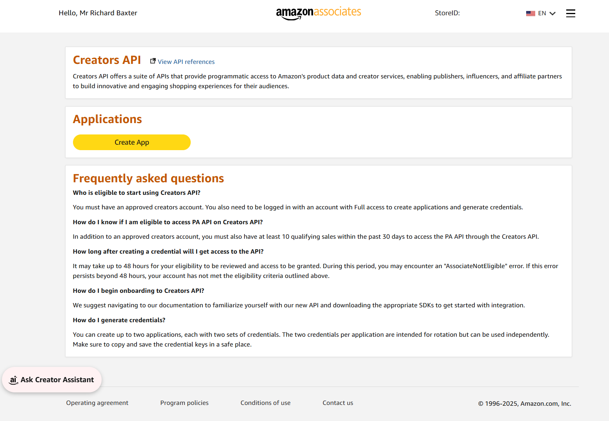
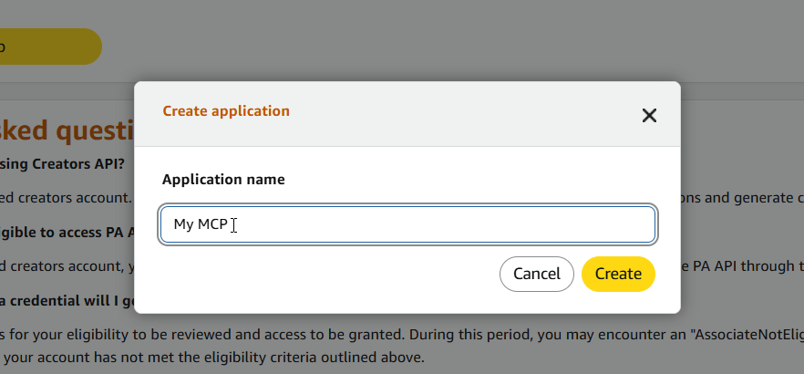
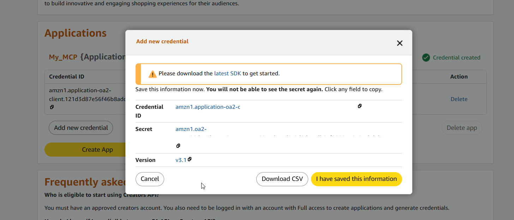

<p align="center">
  
</p>

# Embed Amazon affiliate products in your blog posts with the Amazon Creators API MCP

[](https://www.npmjs.com/package/@houtini/amazon-creators-mcp)
[](https://registry.modelcontextprotocol.io)
[](https://opensource.org/licenses/MIT)
[](https://www.typescriptlang.org/)
[](https://snyk.io/test/github/houtini-ai/amazon-creators-api-mcp)

**Ask Claude to find Amazon products and paste embeddable affiliate cards straight into your blog.**

Search the Amazon catalog, look up specific ASINs, and get back paste-ready HTML cards (with images, prices, ratings, and your affiliate tag already baked in). Previews render inline in Claude Desktop using the official MCP Apps protocol, so you see the card before you paste it. Built for the **Amazon Creators API** &mdash; the REST API that replaces Product Advertising API 5.0 on 30 April 2026.

> **Quick Navigation**
>
> [How to use it with Claude](#how-to-use-it-with-claude) | [Quick start](#quick-start) | [Credentials](#credentials) | [Tools](#tools) | [Output formats](#output-formats) | [Styling](#styling-via-customstyles) | [Development](#development)

---

## How to use it with Claude

The server is built around a conversational loop: you describe what you want, Claude searches, summarises, and only emits HTML when you explicitly ask for the embed. Here are the patterns it's tuned for.

### 1. Find products for a blog post

> *"Find me the best direct-drive racing wheels under £500"*

Claude runs `search_items` and comes back with a conversational summary:

> *I found 8 direct-drive wheels under £500. The standouts are:*
> *&bull; Fanatec CSL DD (£349) — highly rated, 5 Nm motor*
> *&bull; Moza R5 Bundle (£469) — includes pedals, 5.5 Nm*
> *&bull; Cammus C5 (£399) — compact form factor*
> *Would you like me to build an embeddable product grid for your blog?*

### 2. Build the embeddable card or grid

> *"Yes, make a grid of the top three"*

Claude switches to `format: 'html-grid'` and returns a complete HTML document &mdash; with images, prices, savings, star ratings, your Associates tag, the "as of" timestamp, and the required disclosure footer. Paste it into Ghost, Substack, WordPress, or any HTML field.

Claude Desktop renders the grid inline as a preview so you can see it before copying.

### 3. Iterate on the styling without burning rate limit

> *"Give me the same grid but with hotpink CTAs and dark cards"*

Claude calls `format_items` with the `structuredContent` from the previous response &mdash; **no Amazon API call** &mdash; and applies your CSS via `customStyles`:

```json
{
  "response": { "searchResult": { "items": [ /* from prior call */ ] } },
  "format": "html-grid",
  "customStyles": ".amzn-card{background:#0f172a;color:#f1f5f9} .amzn-card__cta{background:hotpink;color:#111}"
}
```

Twenty style tweaks = zero extra API calls. Crucial because the Creators API has real rate limits.

### 4. Look up specific ASINs

> *"Get me the current details for B09B2SBHQK, B08N5M7S6K, and B0BZC6YR7Q"*

Claude calls `get_items`, summarises the three products, and offers to embed them. Order of results is NOT guaranteed to match the input order &mdash; Claude matches on the `asin` field automatically.

### 5. List colour/size variations of a parent product

> *"What colours does the Echo Show 5 come in?"*

Claude calls `get_variations` and lists the variants with individual prices.

---

## Quick start

### Prerequisites

- Node.js 20 or newer
- An approved **Amazon Associates** account for your target marketplace
- At least **10 qualifying Associates sales in the past 30 days** (Amazon's prerequisite for Creators API access)
- Creators API credentials (Credential ID + Credential Secret) from [Associates Central &rarr; Creators API](https://affiliate-program.amazon.com/creatorsapi)

### Step 1: Add to Claude Desktop

Edit your Claude Desktop config file:

- **Windows:** `%APPDATA%\Claude\claude_desktop_config.json`
- **macOS:** `~/Library/Application Support/Claude/claude_desktop_config.json`

```json
{
  "mcpServers": {
    "amazon-creators": {
      "command": "npx",
      "args": ["-y", "@houtini/amazon-creators-mcp"],
      "env": {
        "AMAZON_CLIENT_ID": "amzn1.application-oa2-client.xxxxxxxxxxxxxxxxxxxxxxxxxxxxxxxx",
        "AMAZON_CLIENT_SECRET": "amzn1.oa2-cs.v1.xxxxxxxxxxxxxxxxxxxxxxxxxxxxxxxxxxxxxxxxxxxxxxxxxxxxxxxxxxxxxxx",
        "AMAZON_PARTNER_TAG": "yourtag-20",
        "AMAZON_CREDENTIAL_VERSION": "3.1",
        "AMAZON_MARKETPLACE": "www.amazon.com"
      }
    }
  }
}
```

### Claude Code (CLI)

```bash
claude mcp add \
  -e AMAZON_CLIENT_ID=amzn1.application-oa2-client.xxx \
  -e AMAZON_CLIENT_SECRET=amzn1.oa2-cs.v1.xxx \
  -e AMAZON_PARTNER_TAG=yourtag-20 \
  -e AMAZON_CREDENTIAL_VERSION=3.1 \
  -e AMAZON_MARKETPLACE=www.amazon.com \
  -s user amazon-creators -- npx -y @houtini/amazon-creators-mcp
```

Verify with `claude mcp get amazon-creators` &mdash; you should see `Status: Connected`.

### Step 2: Restart Claude Desktop

Then tell Claude: *"Find me \[whatever you're writing about\] on Amazon"*

---

## Credentials

### Getting your Creators API credentials

Sign in to [Associates Central &rarr; Creators API](https://affiliate-program.amazon.com/creatorsapi) and walk through the three-step app creation flow:

**1. Create a new Creators API application**



**2. Name the application and pick your region**

Your region here determines which `AMAZON_CREDENTIAL_VERSION` you'll use (NA = `3.1`, EU = `3.2`, FE = `3.3` &mdash; full table below).



**3. Copy the Credential ID and Secret**

Amazon generates a Login with Amazon v3.x credential pair. Copy both into your Claude config as `AMAZON_CLIENT_ID` and `AMAZON_CLIENT_SECRET`. These never leave your local machine &mdash; the MCP server authenticates to Amazon directly.



### Environment variables

| Variable | Required | Example | Notes |
|---|---|---|---|
| `AMAZON_CLIENT_ID` | Yes | `amzn1.application-oa2-client.&hellip;` | "Credential Id" from your Creators API CSV |
| `AMAZON_CLIENT_SECRET` | Yes | `amzn1.oa2-cs.v1.&hellip;` | "Secret" from your Creators API CSV |
| `AMAZON_PARTNER_TAG` | Yes | `yourtag-20` | Your Associates tracking ID |
| `AMAZON_CREDENTIAL_VERSION` | Yes | `3.1` / `3.2` / `3.3` | Region-specific &mdash; see table below |
| `AMAZON_MARKETPLACE` | Yes | `www.amazon.com` | Full marketplace host |
| `AMAZON_MAX_CONCURRENCY` | No | `4` | Max concurrent API requests. Default `4`. |
| `DEBUG` | No | `1` | Verbose stderr logging. Default off. |

### Credential version by region

Amazon issues credentials tied to one of three regions. Pick the matching `AMAZON_CREDENTIAL_VERSION` for your marketplace:

| Region | Version | Marketplaces |
|---|---|---|
| **NA** | `3.1` | `www.amazon.com`, `www.amazon.ca`, `www.amazon.com.mx`, `www.amazon.com.br` |
| **EU** | `3.2` | `www.amazon.co.uk`, `www.amazon.de`, `www.amazon.fr`, `www.amazon.it`, `www.amazon.es`, `www.amazon.nl`, `www.amazon.com.be`, `www.amazon.eg`, `www.amazon.in`, `www.amazon.ie`, `www.amazon.pl`, `www.amazon.sa`, `www.amazon.se`, `www.amazon.com.tr`, `www.amazon.ae` |
| **FE** | `3.3` | `www.amazon.co.jp`, `www.amazon.sg`, `www.amazon.com.au` |

> **v2.x Cognito credentials are not supported.** Create a new Login with Amazon application in Associates Central &rarr; Creators API to generate v3.x credentials. The server rejects v2.x on startup with a clear migration message.

---

## Tools

| Tool | Input | What it does |
|---|---|---|
| `search_items` | `keywords` / `actor` / `author` / `brand` / `title` + filters | Search Amazon's catalog. Max 10 items per page; paginate via `itemPage`. |
| `get_items` | `asins: string[]` (1-10) | Look up specific ASINs. Order of results is NOT guaranteed to match input &mdash; match on the `asin` field. |
| `get_variations` | `asin: string` | Size/colour/etc. children of a parent ASIN. |
| `get_browse_nodes` | `browseNodeIds: string[]` | Category metadata + ancestor chain. `json` / `markdown` formats only. |
| `format_items` | `response` *or* `items[]` (from a prior call) | Re-render previously-fetched data locally. **Does not call Amazon.** Ideal for tweaking `customStyles` without burning rate limit. |

All four Amazon-facing tools accept:

- `format`: `'json' | 'markdown' | 'html-card' | 'html-grid'` (default `markdown`; `get_browse_nodes` is `json | markdown` only)
- `resources`: array of camelCase resource paths (e.g. `itemInfo.title`, `offersV2.listings.price`). Omit for a sensible default set.
- `customStyles`: extra CSS appended to the built-in stylesheet when `format` is an HTML variant.
- `titleMaxChars`: cap rendered titles in HTML output (default **80**). Amazon titles are often 150+ chars of SEO noise; 80 keeps cards one-line. Set to `0` to disable. Markdown/JSON always get the full untruncated title.
- `hideItemsWithoutPrice`: when `format` is `html-grid`, drop items that have no price (default **true**). Cards without a price make weak embeds &mdash; no deal hook, no CTA justification. Set `false` for comparison tables.

---

## Output formats

- **`markdown`** &mdash; an image, linked title, price, and Associates disclosure. Paste straight into a blog editor. Full untruncated titles.
- **`html-card`** &mdash; a single self-contained `<article class="amzn-card">` with inline `<style>`. Title capped at `titleMaxChars`. If the item has no price, the price block renders a **"Check price on Amazon"** link using the `.amzn-card__price--unavailable` anchor so the card still has a clear CTA path.
- **`html-grid`** &mdash; a responsive grid of cards for list/search responses. Items with no price are dropped by default (override with `hideItemsWithoutPrice: false`).
- **`json`** &mdash; the parsed response envelope, pretty-printed.

Preview rendering is handled by a single shared viewer resource at `ui://amazon-creators/viewer.html`, discovered via `_meta.ui.resourceUri` on every tool definition. The viewer is a self-contained HTML document (bundled at build time) that boots the official `@modelcontextprotocol/ext-apps` client, subscribes to tool results over `postMessage`, and renders the returned HTML inside a nested sandboxed iframe.

Hosts without MCP Apps support still get the plain-text HTML content &mdash; which IS the document the creator pastes into their blog.

---

## Styling via `customStyles`

HTML output exposes these stable class-name hooks:

```
.amzn-card                    .amzn-card__image              .amzn-card__title
.amzn-card__meta              .amzn-card__brand              .amzn-card__rating
.amzn-card__price             .amzn-card__price--unavailable .amzn-card__savings
.amzn-card__cta               .amzn-card__disclosure         .amzn-grid
```

Every visible element has a stable anchor so you can restyle through conversation:

> *"Make the CTA hotpink and the card a dark rounded rectangle."*

```json
{
  "keywords": "coffee grinder",
  "format": "html-card",
  "customStyles": ".amzn-card{background:#0f172a;color:#f1f5f9;border-radius:20px} .amzn-card__cta{background:hotpink;color:#111}"
}
```

The `.amzn-card__price--unavailable` modifier only appears on the price `<p>` when Amazon returned no price for the item (falls back to "Check price on Amazon"). It's always defined in the default stylesheet so custom rules targeting it are safe to include unconditionally.

---

## Iterating without re-querying Amazon

Call `search_items` once, keep the returned `structuredContent`, then call `format_items` as many times as you like:

```json
{
  "response": { "searchResult": { "items": [ /* from prior call */ ] } },
  "format": "html-grid",
  "customStyles": ".amzn-card{border-radius:20px}"
}
```

`format_items` also accepts a flat `items: [...]` array if you've already extracted them.

---

## Associates compliance

The server bakes in the things the Associates Operating Agreement requires when you display affiliate product data:

- Your `AMAZON_PARTNER_TAG` is injected into every outbound URL (preferring the pre-tagged `detailPageURL` returned by the API, falling back to a constructed `/dp/ASIN?tag=&hellip;` URL).
- Every outbound link carries `rel="nofollow sponsored noopener"`.
- When a price is displayed, a retrieval timestamp (`as of &lt;ISO-8601&gt;`) is rendered next to it.
- Every card and grid ends with the Amazon Associates disclosure footer.

---

## Development

```bash
git clone https://github.com/houtini-ai/amazon-creators-api-mcp
cd amazon-creators-api-mcp
npm install
npm run build
```

| Command | Description |
|---------|-------------|
| `npm run build` | Build everything (viewer bundle + TypeScript) |
| `npm run build:viewer` | Build the MCP Apps viewer HTML bundle only |
| `npm run dev` | Watch mode for server TypeScript |
| `npm run test` | Run vitest (103 tests across unit + integration) |
| `npm run typecheck` | TypeScript type check without emit |
| `npm run lint` | ESLint |

See [SCOPE.md](./SCOPE.md) for the architectural plan, and [CLAUDE.md](./CLAUDE.md) for contributor / agent notes.

---

## Troubleshooting

**"Credential version rejected"** &mdash; You're using v2.x Cognito credentials. Create a Login with Amazon app in Associates Central &rarr; Creators API to generate v3.x credentials, then set `AMAZON_CREDENTIAL_VERSION` to `3.1`, `3.2`, or `3.3` depending on your region.

**401 / 403 errors** &mdash; Check that your Associates account has the required 10 qualifying sales in the past 30 days and that Creators API access is enabled in Associates Central.

**Preview images not rendering in Claude Desktop** &mdash; The viewer resource allowlists `m.media-amazon.com` and the three regional `ssl-images-amazon` CDNs via `_meta.ui.csp`. If you're on a host that implements a stricter CSP, it may block third-party images. The plain-text HTML output is unaffected &mdash; it renders fine once pasted into your blog.

**"Order of items doesn't match my input"** &mdash; By design. `get_items` is allowed to return items in any order and to omit invalid/inaccessible ASINs entirely (they show up in a separate `errors` array). Match on the `asin` field, not by index. Claude does this automatically when summarising.

---

## Licence

MIT. See [LICENSE](LICENSE) for details.

---

Built by [Houtini](https://houtini.ai) for the Model Context Protocol community. Part of the houtini-ai MCP suite.
